# Cú pháp cơ bản

#### Các phần tử Markdown được nêu trong tài liệu thiết kế ban đầu.

## Tổng quan

Gần như tất cả các ứng dụng Markdown đều hỗ trợ cú pháp cơ bản được nêu trong tài liệu thiết kế Markdown gốc. Có những biến thể và khác biệt nhỏ giữa các bộ xử lý Markdown — những biến thể và khác biệt này sẽ được ghi chú nội tuyến bất cứ khi nào có thể.

## Tiêu đề

Để tạo tiêu đề, hãy thêm ký hiệu số (#) trước một từ hoặc cụm từ. Số lượng ký hiệu số bạn sử dụng phải tương ứng với cấp độ tiêu đề. Ví dụ: để tạo tiêu đề cấp ba \<h3>\, hãy sử dụng ba ký hiệu số (ví dụ: ### Tiêu đề của tôi).

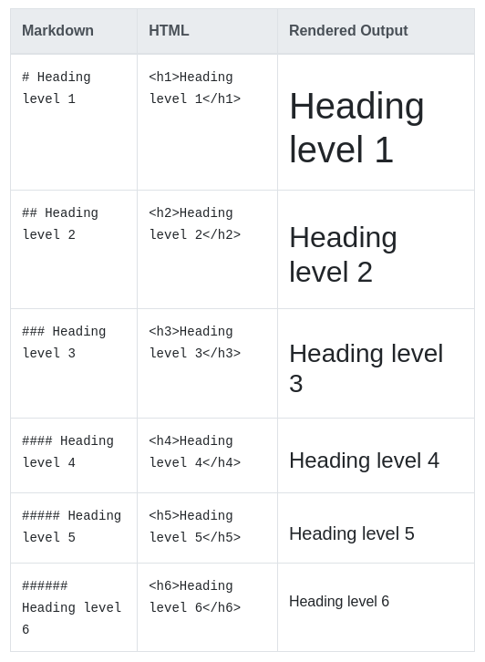

## Cú pháp thay thế
Ngoài ra, trên dòng bên dưới văn bản, thêm bất kỳ số ký tự == nào cho tiêu đề cấp 1 hoặc -- ký tự cho tiêu đề cấp 2.

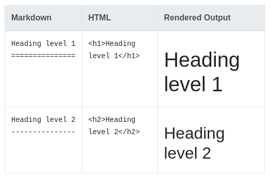

## Tiêu đề Thực tiễn tốt nhất
Các ứng dụng Markdown không đồng ý về cách xử lý khoảng trắng bị thiếu giữa các ký hiệu số (#) và tên tiêu đề. Để tương thích, hãy luôn đặt khoảng trắng giữa các ký hiệu số và tên tiêu đề.

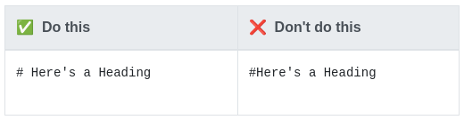
Bạn cũng nên để dòng trống trước và sau tiêu đề để tương thích.

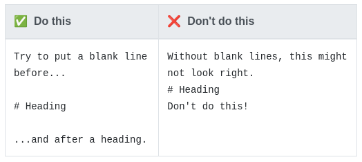

## Đoạn văn
Để tạo đoạn văn, hãy sử dụng dòng trống để phân tách một hoặc nhiều dòng văn bản.

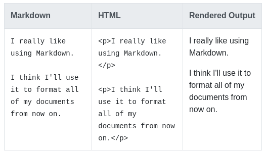

## Đoạn Thực tiễn Tốt nhất
Trừ khi đoạn văn đó nằm trong danh sách, không thụt lề đoạn văn bằng dấu cách hoặc tab.

> Lưu ý: Nếu bạn cần thụt lề các đoạn văn ở đầu ra, hãy xem phần cách thụt lề (tab).

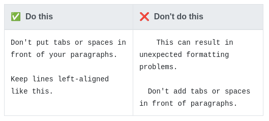

## Ngắt dòng

Để tạo ngắt dòng hoặc dòng mới \  , hãy kết thúc một dòng bằng hai khoảng trắng trở lên, sau đó nhập return.

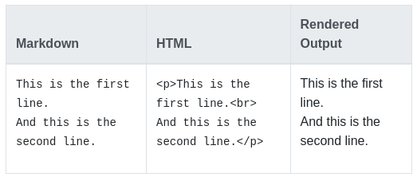

## Thực tiễn tốt nhất về ngắt dòng
Bạn có thể sử dụng hai hoặc nhiều khoảng trắng (thường được gọi là “khoảng trắng ở cuối”) để ngắt dòng trong hầu hết mọi ứng dụng Markdown, nhưng điều này còn gây tranh cãi. Thật khó để nhìn thấy khoảng trắng ở cuối trong trình soạn thảo và nhiều người vô tình hoặc cố ý đặt hai dấu cách sau mỗi câu. Vì lý do này, bạn có thể muốn sử dụng thứ gì đó ngoài khoảng trắng ở cuối để ngắt dòng. Nếu ứng dụng Markdown của bạn hỗ trợ HTML, bạn có thể sử dụng thẻ HTML \ .

Để tương thích, hãy sử dụng khoảng trắng ở cuối hoặc thẻ HTML \  ở cuối dòng.

Có hai tùy chọn khác mà tôi không khuyên bạn nên sử dụng. CommonMark và một số ngôn ngữ đánh dấu nhẹ khác cho phép bạn nhập dấu gạch chéo ngược ( \ ) ở cuối dòng, nhưng không phải tất cả các ứng dụng Markdown đều hỗ trợ điều này, vì vậy đây không phải là một lựa chọn tuyệt vời xét từ góc độ tương thích. Và ít nhất một vài ngôn ngữ đánh dấu nhẹ không yêu cầu bất kỳ thứ gì ở cuối dòng - chỉ cần gõ return và chúng sẽ tạo dấu ngắt dòng.

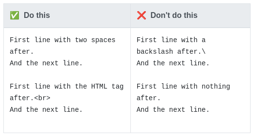

## Nhấn mạnh
Bạn có thể thêm điểm nhấn bằng cách in đậm hoặc in nghiêng văn bản.
## In đậm
Để in đậm văn bản, hãy thêm hai dấu hoa thị hoặc dấu gạch dưới trước và sau một từ hoặc cụm từ. Để in đậm phần giữa của từ để nhấn mạnh, hãy thêm hai dấu hoa thị không có dấu cách xung quanh các chữ cái.

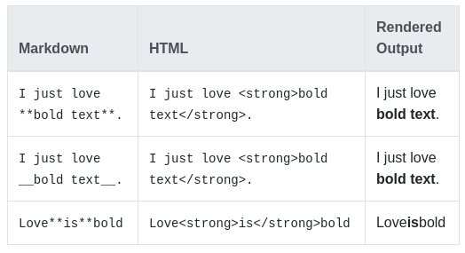

## Thực tiễn tốt nhất
Các ứng dụng Markdown không thống nhất về cách xử lý dấu gạch dưới ở giữa từ. Để tương thích, hãy sử dụng dấu hoa thị để in đậm ở giữa từ để nhấn mạnh.

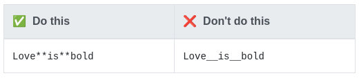

## In nghiêng
Để in nghiêng văn bản, hãy thêm một dấu hoa thị hoặc dấu gạch dưới trước và sau một từ hoặc cụm từ. Để in nghiêng phần giữa của từ để nhấn mạnh, hãy thêm một dấu hoa thị không có dấu cách xung quanh các chữ cái.

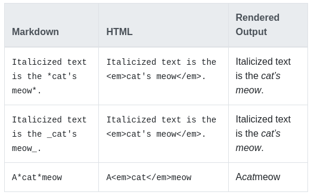

## Các phương pháp hay nhất về chữ nghiêng
Các ứng dụng Markdown không thống nhất về cách xử lý dấu gạch dưới ở giữa từ. Để tương thích, hãy sử dụng dấu hoa thị để in nghiêng phần giữa của từ để nhấn mạnh.

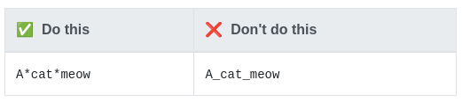

## In đậm và in nghiêng
Để nhấn mạnh văn bản bằng cả in đậm và in nghiêng cùng lúc, hãy thêm ba dấu hoa thị hoặc dấu gạch dưới trước và sau một từ hoặc cụm từ. Để in đậm và in nghiêng phần giữa của từ để nhấn mạnh, hãy thêm ba dấu hoa thị không có dấu cách xung quanh các chữ cái.

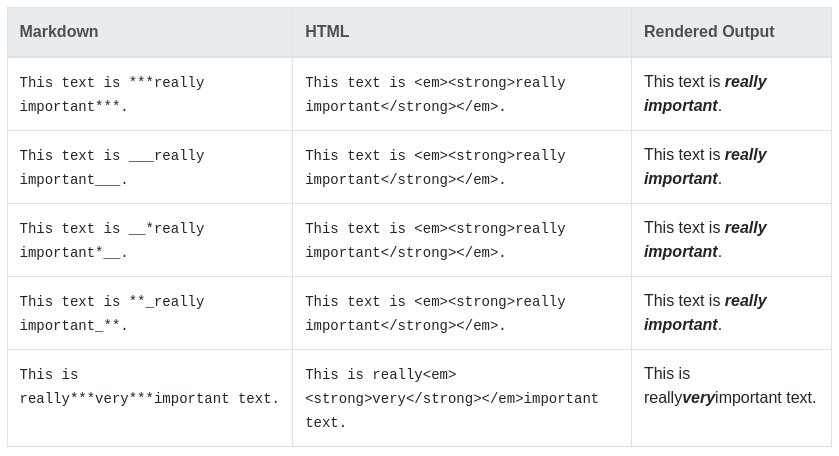
 
> Lưu ý: Thứ tự của thẻ `em` và thẻ `strong` có thể bị đảo ngược tùy thuộc vào bộ xử lý Markdown mà bạn đang sử dụng.

## Các phương pháp hay nhất về in đậm và in nghiêng
Các ứng dụng Markdown không thống nhất về cách xử lý dấu gạch dưới ở giữa từ. Để tương thích, hãy sử dụng dấu hoa thị để in đậm và in nghiêng ở giữa từ để nhấn mạnh.

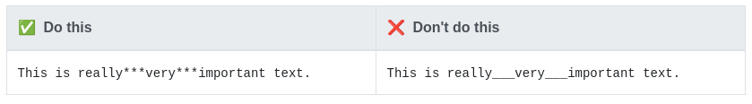

## Trích dẫn khối
Để tạo một đoạn trích dẫn, hãy thêm dấu > vào trước đoạn văn.

     > Dorothy followed her through many of the beautiful rooms in her castle.

Kết quả đầu ra được hiển thị trông như thế này:

>Dorothy followed her through many of the beautiful rooms in her castle.

## Trích dẫn khối có nhiều đoạn
Đoạn trích có thể chứa nhiều đoạn văn. Thêm dấu > vào các dòng trống giữa các đoạn văn.

    > Dorothy followed her through many of the beautiful rooms in her castle.
    >
    > The Witch bade her clean the pots and kettles and sweep the floor and keep the fire fed with wood.

Kết quả đầu ra được hiển thị trông như thế này:

>Dorothy followed her through many of the beautiful rooms in her castle.
>
>The Witch bade her clean the pots and kettles and sweep the floor and keep the fire fed with wood.

## Trích dẫn khối lồng nhau
Trích dẫn khối có thể được lồng nhau. Thêm >> vào trước đoạn bạn muốn lồng.

    > Dorothy followed her through many of the beautiful rooms in her castle.
    >
    >> The Witch bade her clean the pots and kettles and sweep the floor and keep the fire fed with wood.

Kết quả đầu ra được hiển thị trông như thế này:

> Dorothy followed her through many of the beautiful rooms in her castle.
>
>> The Witch bade her clean the pots and kettles and sweep the floor and keep the fire fed with wood.

## Trích dẫn khối với các yếu tố
Trích dẫn khối có thể chứa các phần tử được định dạng Markdown khác. Không phải tất cả các yếu tố đều có thể được sử dụng - bạn sẽ cần thử nghiệm để xem yếu tố nào hoạt động.

    > #### The quarterly results look great!
    >
    > - Revenue was off the chart.
    > - Profits were higher than ever.
    >
    >  *Everything* is going according to **plan**.

Kết quả đầu ra được hiển thị trông như thế này:

> #### The quarterly results look great!
>
> - Revenue was off the chart.
> - Profits were higher than ever.
>
>  *Everything* is going according to **plan**.

## Các phương pháp hay nhất về  trích dẫn khối
Để tương thích, hãy đặt dòng trống trước và sau dấu ngoặc kép.

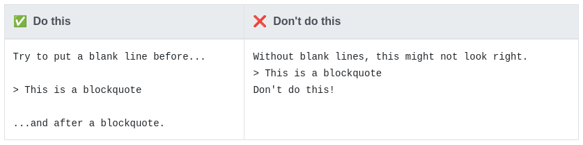

## Danh sách
Bạn có thể sắp xếp các mục thành danh sách có thứ tự và không có thứ tự.

## Danh sách đặt hàng
Để tạo danh sách có thứ tự, hãy thêm các mục hàng có số theo sau là dấu chấm. Các số không nhất thiết phải theo thứ tự số, nhưng danh sách phải bắt đầu bằng số một.

## Danh sách có thứ tự
Để tạo danh sách có thứ tự, hãy thêm các mục hàng có số theo sau là dấu chấm. Các số không nhất thiết phải theo thứ tự số, nhưng danh sách phải bắt đầu bằng số một.

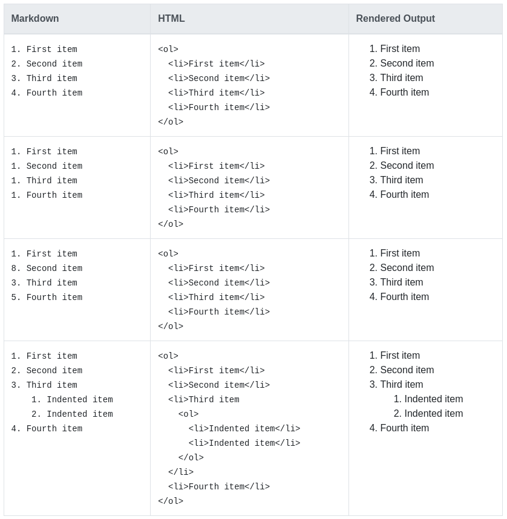

## Danh sách có thứ tự Thực tiễn tốt nhất
CommonMark và một số ngôn ngữ đánh dấu nhẹ khác cho phép bạn sử dụng dấu ngoặc đơn ()) làm dấu phân cách (ví dụ: 1) Mục đầu tiên), nhưng không phải tất cả các ứng dụng Markdown đều hỗ trợ điều này, vì vậy đây không phải là một lựa chọn tuyệt vời xét từ góc độ tương thích. Để tương thích, chỉ sử dụng dấu chấm.

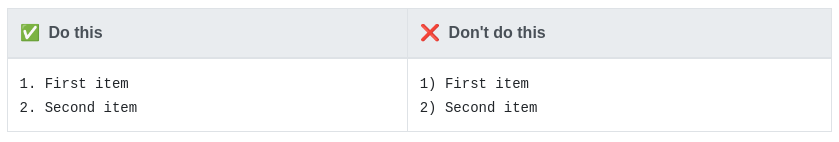

## Danh sách không có thứ tự
Để tạo danh sách không có thứ tự, hãy thêm dấu gạch ngang (-), dấu hoa thị (*) hoặc dấu cộng (+) trước mục hàng. Thụt lề một hoặc nhiều mục để tạo danh sách lồng nhau.

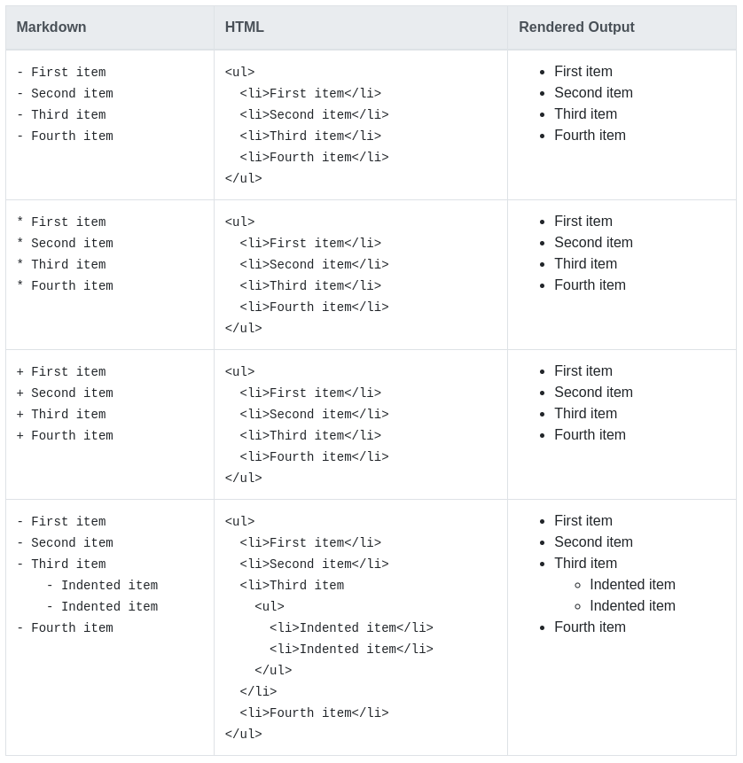

## Bắt đầu các mục danh sách không có thứ tự bằng số
Nếu bạn cần bắt đầu một mục danh sách không có thứ tự với một số theo sau là dấu chấm, bạn có thể sử dụng dấu gạch chéo ngược ( \ ) để thoát khỏi dấu chấm.

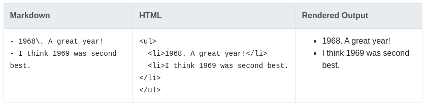

## Các phương pháp hay nhất về danh sách không có thứ tự
Các ứng dụng Markdown không thống nhất về cách xử lý các dấu phân cách khác nhau trong cùng một danh sách. Để tương thích, đừng trộn lẫn các dấu phân cách trong cùng một danh sách — hãy chọn một dấu phân cách và bám theo nó.

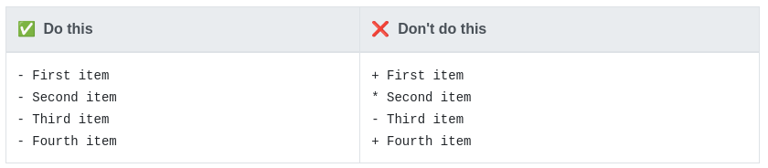

## Thêm phần tử vào danh sách
Để thêm một phần tử khác vào danh sách trong khi vẫn duy trì tính liên tục của danh sách, hãy thụt lề phần tử đó bốn dấu cách hoặc một tab, như minh họa trong các ví dụ sau.

>Mẹo: Nếu mọi thứ không xuất hiện theo cách bạn mong đợi, hãy kiểm tra kỹ xem bạn đã thụt lề các thành phần trong danh sách bằng bốn dấu cách hay một tab hay chưa.

## Đoạn văn

    * This is the first list item.
    * Here's the second list item.

        I need to add another paragraph below the second list item.

    * And here's the third list item.

Kết quả đầu ra được hiển thị trông như thế này:

* This is the first list item.
* Here's the second list item.

    I need to add another paragraph below the second list item.

* And here's the third list item.

## Trích dẫn khối

    * Here's the second list item.

        > A blockquote would look great below the second list item.

    * And here's the third list item.

Kết quả đầu ra được hiển thị trông như thế này:

* Here's the second list item.

    > A blockquote would look great below the second list item.

* And here's the third list item.

## Khối lệnh
Các khối lệnh thường được thụt vào bốn dấu cách hoặc một tab. Khi chúng ở trong danh sách, hãy thụt lề chúng tám dấu cách hoặc hai tab.

    1. Open the file.
    2. Find the following code block on line 21:

        <html>
          <head>
            <title>Test</title>
          </head>

    3. Update the title to match the name of your website.

Kết quả đầu ra được hiển thị trông như thế này:

1. Open the file.
2. Find the following code block on line 21:

        <html>
          <head>
            <title>Test</title>
          </head>

3. Update the title to match the name of your website.

## Hình ảnh

    1. Open the file containing the Linux mascot.
    2. Marvel at its beauty.

        

    3. Close the file.

Kết quả đầu ra được hiển thị trông như thế này:

1. Open the file containing the Linux mascot.
2. Marvel at its beauty.

    

3. Close the file.

## Danh sách

Bạn có thể lồng một danh sách không có thứ tự vào một danh sách có thứ tự hoặc ngược lại.

        1. First item
        2. Second item
        3. Third item
            - Indented item
            - Indented item
        4. Fourth item

Kết quả đầu ra được hiển thị trông như thế này:

1. First item
2. Second item
3. Third item
    - Indented item
    - Indented item
4. Fourth item

# Code

Để biểu thị một từ hoặc cụm từ dưới dạng mã, hãy đặt nó trong dấu backticks (`).

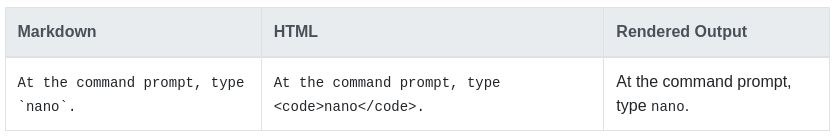

## Thoát khỏi dấu tích ngược
Nếu từ hoặc cụm từ bạn muốn biểu thị dưới dạng mã bao gồm một hoặc nhiều dấu phẩy ngược, bạn có thể thoát khỏi từ hoặc cụm từ đó bằng cách đặt từ hoặc cụm từ đó trong dấu phẩy ngược kép (``).

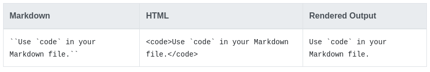

## Khối lệnh 
Để tạo các khối mã, hãy thụt lề mỗi dòng của khối ít nhất bốn dấu cách hoặc một tab.

    <html>
      <head>
      </head>
    </html>

Kết quả đầu ra được hiển thị trông như thế này:

    <html>
      <head>
      </head>
    </html>

>Lưu ý: Để tạo các khối mã không thụt dòng, hãy sử dụng các khối mã có rào chắn.

## Quy tắc ngang
Để tạo quy tắc ngang, hãy sử dụng ba dấu sao trở lên (***), dấu gạch ngang (---) hoặc dấu gạch dưới (___) trên một dòng.

    ***
    ---
    ________

Kết quả đầu ra được hiển thị của cả ba trông giống hệt nhau:

---

## Các phương pháp hay nhất về quy tắc ngang
Để tương thích, hãy đặt các dòng trống trước và sau các quy tắc ngang.

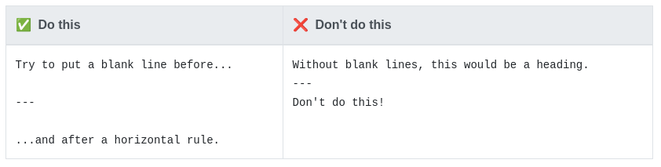

## Liên kết

Để tạo một liên kết, hãy đặt văn bản liên kết trong ngoặc (ví dụ: [Duck Duck Go]) rồi theo sau nó ngay lập tức bằng URL trong ngoặc đơn (ví dụ: (https://duckduckgo.com)).

    My favorite search engine is [Duck Duck Go](https://duckduckgo.com).

Kết quả đầu ra được hiển thị trông như thế này:

My favorite search engine is [Duck Duck Go](https://duckduckgo.com).

>Lưu ý: Để liên kết đến một phần tử trên cùng một trang, hãy xem liên kết đến ID tiêu đề. Để tạo liên kết mở trong tab hoặc cửa sổ mới, hãy xem phần về mục tiêu liên kết.

# Thêm tiêu đề
Bạn có thể tùy ý thêm tiêu đề cho một liên kết. Điều này sẽ xuất hiện dưới dạng chú giải công cụ khi người dùng di chuột qua liên kết. Để thêm tiêu đề, hãy đặt tiêu đề đó trong dấu ngoặc kép sau URL.

    My favorite search engine is [Duck Duck Go](https://duckduckgo.com "The best search engine for privacy").

Kết quả đầu ra được hiển thị trông như thế này:

My favorite search engine is [Duck Duck Go](https://duckduckgo.com "The best search engine for privacy").

## URL và địa chỉ email
Để nhanh chóng biến một URL hoặc địa chỉ email thành một liên kết, hãy đặt nó trong dấu ngoặc nhọn.

    <https://www.markdownguide.org>
    <fake@example.com>

Kết quả đầu ra được hiển thị trông như thế này:

<https://www.markdownguide.org>

<fake@example.com>

## Liên kết định dạng
Để nhấn mạnh các liên kết, hãy thêm dấu hoa thị trước và sau dấu ngoặc và dấu ngoặc đơn. Để biểu thị các liên kết dưới dạng mã, hãy thêm dấu ngược vào dấu ngoặc.

    I love supporting the **[EFF](https://eff.org)**.
    This is the *[Markdown Guide](https://www.markdownguide.org)*.
    See the section on [`code`](#code).

Kết quả đầu ra được hiển thị trông như thế này:

I love supporting the **[EFF](https://eff.org)**.

This is the *[Markdown Guide](https://www.markdownguide.org)*.

See the section on [`code`](#code).

## Liên kết kiểu tham chiếu

Liên kết kiểu tham chiếu là một loại liên kết đặc biệt giúp URL dễ hiển thị và đọc hơn trong Markdown. Các liên kết kiểu tham chiếu được xây dựng thành hai phần: phần bạn giữ trong dòng với văn bản của mình và phần bạn lưu trữ ở một nơi khác trong tệp để giữ cho văn bản dễ đọc.

## Định dạng phần đầu tiên của liên kết

Phần đầu tiên của liên kết kiểu tham chiếu được định dạng bằng hai bộ dấu ngoặc. Bộ dấu ngoặc đầu tiên bao quanh văn bản sẽ xuất hiện liên kết. Bộ dấu ngoặc thứ hai hiển thị nhãn được sử dụng để trỏ đến liên kết bạn đang lưu trữ ở nơi khác trong tài liệu của mình.

Mặc dù không bắt buộc nhưng bạn có thể thêm khoảng trắng giữa cặp dấu ngoặc thứ nhất và thứ hai. Nhãn trong bộ dấu ngoặc thứ hai không phân biệt chữ hoa chữ thường và có thể bao gồm các chữ cái, số, dấu cách hoặc dấu câu.

Điều này có nghĩa là các định dạng ví dụ sau gần tương đương với phần đầu tiên của liên kết:

- [hobbit-hole][1]
- [hobbit-hole] [1]

## Định dạng phần thứ hai của liên kết
Phần thứ hai của liên kết kiểu tham chiếu được định dạng với các thuộc tính sau:

1. Nhãn, trong ngoặc, ngay sau đó là dấu hai chấm và ít nhất một khoảng trắng (ví dụ: [nhãn]: ).

1. URL của liên kết mà bạn có thể tùy ý đặt trong dấu ngoặc nhọn.

1. Tiêu đề tùy chọn cho liên kết mà bạn có thể đặt trong dấu ngoặc kép, dấu ngoặc đơn hoặc dấu ngoặc đơn.

Bạn có thể đặt phần thứ hai của liên kết này ở bất kỳ đâu trong tài liệu Markdown của mình. Một số người đặt chúng ngay sau đoạn văn mà chúng xuất hiện trong khi những người khác đặt chúng ở cuối tài liệu (như chú thích cuối trang hoặc chú thích cuối trang).

## Một ví dụ về việc kết hợp các bộ phận lại với nhau

Giả sử bạn thêm một URL làm liên kết URL tiêu chuẩn vào một đoạn văn và nó trông như thế này trong Markdown:

    In a hole in the ground there lived a hobbit. Not a nasty, dirty, wet hole, filled with the ends
    of worms and an oozy smell, nor yet a dry, bare, sandy hole with nothing in it to sit down on or to
    eat: it was a [hobbit-hole](https://en.wikipedia.org/wiki/Hobbit#Lifestyle "Hobbit lifestyles"), and that means comfort.

Mặc dù nó có thể trỏ đến thông tin bổ sung thú vị, nhưng URL được hiển thị thực sự không bổ sung nhiều vào văn bản thô hiện có ngoài việc khiến nó khó đọc hơn. Để khắc phục điều đó, thay vào đó bạn có thể định dạng URL như thế này:

In a hole in the ground there lived a hobbit. Not a nasty, dirty, wet hole, filled with the ends
of worms and an oozy smell, nor yet a dry, bare, sandy hole with nothing in it to sit down on or to
eat: it was a [hobbit-hole][1], and that means comfort.

    [1]: <https://en.wikipedia.org/wiki/Hobbit#Lifestyle> "Hobbit lifestyles"

Trong cả hai trường hợp trên, kết quả được hiển thị sẽ giống hệt nhau:

>In a hole in the ground there lived a hobbit. Not a nasty, dirty, wet hole, filled with the ends
    of worms and an oozy smell, nor yet a dry, bare, sandy hole with nothing in it to sit down on or to
    eat: it was a [hobbit-hole](https://en.wikipedia.org/wiki/Hobbit#Lifestyle "Hobbit lifestyles"), and that means comfort.

và HTML cho liên kết sẽ là:

    <a href="https://en.wikipedia.org/wiki/Hobbit#Lifestyle" title="Hobbit lifestyles">hobbit-hole</a>

## Liên kết các phương pháp hay nhất
Các ứng dụng Markdown không đồng ý về cách xử lý khoảng trắng ở giữa URL. Để tương thích, hãy thử mã hóa URL bất kỳ khoảng trắng nào bằng %20. Ngoài ra, nếu ứng dụng Markdown của bạn hỗ trợ HTML, bạn có thể sử dụng thẻ HTML.

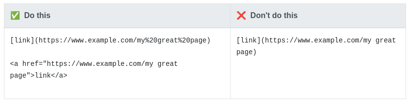

Dấu ngoặc đơn ở giữa URL cũng có thể có vấn đề. Để tương thích, hãy thử mã hóa URL dấu ngoặc đơn mở (() với %28 và dấu ngoặc đơn đóng ()) với %29. Ngoài ra, nếu ứng dụng Markdown của bạn hỗ trợ HTML, bạn có thể sử dụng thẻ HTML.

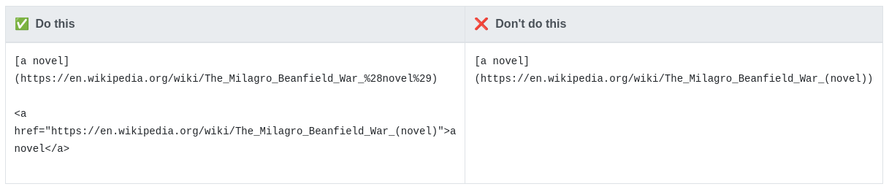

## Hình ảnh

Để thêm hình ảnh, hãy thêm dấu chấm than (!), theo sau là văn bản thay thế trong ngoặc và đường dẫn hoặc URL tới nội dung hình ảnh trong ngoặc đơn. Bạn có thể tùy ý thêm tiêu đề trong dấu ngoặc kép sau đường dẫn hoặc URL.

    

The rendered output looks like this:

>Lưu ý: Để thay đổi kích thước hình ảnh, hãy xem phần về kích thước hình ảnh. Để thêm chú thích, hãy xem phần chú thích hình ảnh.

## Liên kết hình ảnh
Để thêm liên kết vào hình ảnh, hãy đặt Markdown cho hình ảnh trong ngoặc, sau đó thêm liên kết trong ngoặc đơn.

    

Kết quả đầu ra được hiển thị trông như thế này:

## Nhân vật trốn thoát
Để hiển thị một ký tự bằng chữ thường được sử dụng để định dạng văn bản trong tài liệu Markdown, hãy thêm dấu gạch chéo ngược ( \ ) trước ký tự.

    \* Nếu không có dấu gạch chéo ngược, đây sẽ là dấu đầu dòng trong danh sách không có thứ tự.

Kết quả đầu ra được hiển thị trông như thế này:

 \* Nếu không có dấu gạch chéo ngược, đây sẽ là dấu đầu dòng trong danh sách không có thứ tự.

## Characters You Can Escape
Bạn có thể sử dụng dấu gạch chéo ngược để thoát khỏi các ký tự sau.

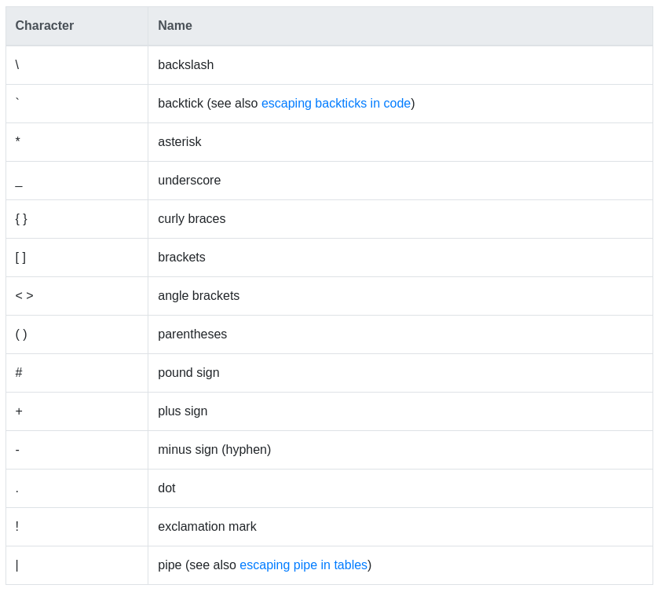

## HTML
Nhiều ứng dụng Markdown cho phép bạn sử dụng thẻ HTML trong văn bản có định dạng Markdown. Điều này hữu ích nếu bạn thích một số thẻ HTML nhất định hơn cú pháp Markdown. Ví dụ: một số người thấy việc sử dụng thẻ HTML cho hình ảnh sẽ dễ dàng hơn. Sử dụng HTML cũng hữu ích khi bạn cần thay đổi thuộc tính của một phần tử, như chỉ định màu của văn bản hoặc thay đổi độ rộng của hình ảnh.

Để sử dụng HTML, hãy đặt các thẻ vào văn bản của tệp có định dạng Markdown của bạn.

    This **word** is bold. This <em>word</em> is italic.

    Kết quả đầu ra được hiển thị trông như thế này:

    This **word** is bold. This <em>word</em> is italic.

## Thực tiễn tốt nhất về HTML

Vì lý do bảo mật, không phải tất cả ứng dụng Markdown đều hỗ trợ HTML trong tài liệu Markdown. Khi nghi ngờ, hãy kiểm tra tài liệu của ứng dụng Markdown của bạn. Một số ứng dụng chỉ hỗ trợ một tập hợp con các thẻ HTML.

Sử dụng các dòng trống để phân tách các phần tử HTML cấp khối như < div >, < table >, < pre > và < p > khỏi nội dung xung quanh. Cố gắng không thụt lề các thẻ bằng tab hoặc dấu cách — điều đó có thể ảnh hưởng đến việc định dạng.

Bạn không thể sử dụng cú pháp Markdown bên trong các thẻ HTML cấp khối. Ví dụ: < p > in nghiêng và ** đậm ** < /p > sẽ không hoạt động.